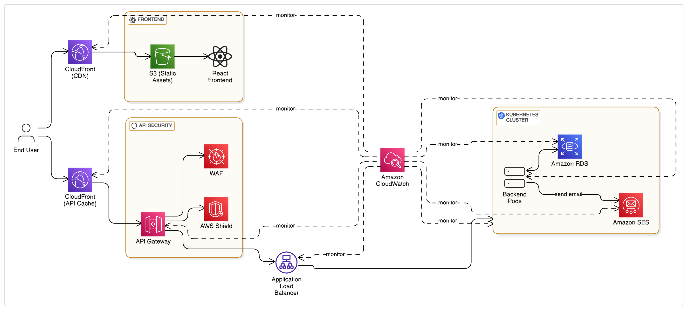

# QAirline Cloud Infrastructure

## Infrastructure Overview

End users initiate requests through **Amazon CloudFront**, which serves as a global content delivery network (CDN) providing low-latency access, HTTPS support, and custom domain integration.

Static assets for the **React frontend** are hosted on **Amazon S3**, and **CloudFront** caches and delivers this content efficiently to users.

Once the frontend is loaded through user's browser, data requests from the client are routed through **Cloudfront** for caching then into an **API Gateway** which is also protected by **AWS WAF** and **AWS Shield**, this acts as a secure and scalable entry point for backend services, the reason for this architecture is because Cloudfront acts as a cache which can help reduce api requests, in turn reduces cost. API Gateway forwards these requests to an **Application Load Balancer (ALB)** integrated with an Kubernetes cluster.

Within the cluster, backend services run in scalable Pods, processing requests and managing business logic. These services interact with a **relational database** hosted on **Amazon RDS** (Relational Database Service) for persistent data storage.

The backend also uses **Amazon SES** (Simple Email Service) for sending emails, such as booking confirmations and notifications.

The overall infrastructure is monitored using **Amazon CloudWatch**, which provides insights into application performance and resource utilization.

To ensure observability and reliability, the entire system is integrated with Amazon CloudWatch. Logs from ALB, CloudFront, API Gateway, EC2 nodes, and RDS are collected and stored in CloudWatch Logs or S3 buckets, while key metrics such as CPU utilization, error rates, and request counts are continuously tracked for services like ALB, EC2, RDS, and API Gateway. Alarms are configured to notify via SNS/email when thresholds are breached (e.g., high CPU, 5XX errors), and a CloudWatch Dashboard offers a real-time, unified view of system health and performance.



## S3 buckets

Our frontend is a React application that is built using the React framework, which is why we decided to use S3 to host the static files(a common cloud architecture). The S3 bucket is configured to be only accessible through Cloudfront.

## EC2 Instances

The EC2 instances are used to host the Kubernetes cluster, their primarily role serving as Kubernetes nodes. The instances are provisioned using Terraform and Ansible, and are configured to be part of the Kubernetes cluster.

## Kubernetes and ALB

The Kubernetes cluster is used to host the backend services, which was built using FastAPI. The cluster exposed using NodePort, which are then connected to a self-provisioned Application Load Balancer (ALB). The ALB is configured to route traffic to the appropriate Kubernetes nodes based on the NodePort.

The reason why we used a self-hosted Kubernetes instead of using EKS is because we wanted things to stay in AWS Free Tier and keep it as cheap as possible. EKS is a managed service that comes with a cost, and we wanted to avoid that.

## RDS 

The backend services access the RDS database using the database connection string. The RDS database is used in 2 Available Zones(ap-southeast-1a, and ap-southeast-1b).

## API Gateway

The API Gateway is used to expose the backend services to the internet. The API Gateway is configured to route traffic to the ALB, which in turn routes traffic to the Kubernetes cluster. The API Gateway is also configured to use AWS WAF and AWS Shield for security.

The version of API Gateway we use is HTTP API and not REST API, because HTTP API is cheaper than REST API, and we do not need the features of REST API.

## CloudFront

The CloudFront distribution is used to cache the static files from the S3 bucket due to the fact that S3 does not support SSL, and to route and cache traffic to the API Gateway to reduce egress cost. The CloudFront distribution is configured to use HTTPS, and to cache the static files for a period of time.

Cloudfront not only works as a CDN, but also works in reducing cost in data transfer of S3. 

In the free tier pricing, S3 egress is begins charging at 100GB of data, while Cloudfront egress is free for the first 1TB of data. This means that if you have a lot of data transfer from S3, you will be charged for it, while if you use Cloudfront, you will not be charged for the first 1TB of data transfer, and adding to the fact that data from S3 to Cloudfront is free. Our frontend hosting cost is virtually non-existent.

Moving past free tier, S3 egress (Data Transfer OUT from S3 to Internet) in the Asia Pacific (Singapore) region is $0.12 per GB for the first 10 GB, while CloudFront egress (Data Transfer OUT from CloudFront to Internet) is $0.085 per GB for the first 10 TB and only get cheaper from there. This means that using Cloudfront not only is faster for end users but also cheaper for us. The same also applies to API Gateway, where the data transfer cost is cheaper when using Cloudfront.

# QairlineInfra Setup and Run Guide

## Setup Instructions

### 1. Clone the Repositories

Clone both the `qairlineinfra` and `QairlineCiCd` repositories to your local machine. Ensure they are in the same directory level.

```bash
git clone <qairlineinfra-repo-url>
git clone <QairlineCiCd-repo-url>
```

Replace `<qairlineinfra-repo-url>` and `<QairlineCiCd-repo-url>` with the actual repository URLs.

### 2. Create an IAM User with AdministratorAccess

To quickly set up an IAM user with full administrative privileges:

1. Log in to the AWS Management Console.
2. Navigate to **IAM** > **Users** > **Add users**.
3. Enter a username.
4. Select **Access key - Programmatic access** for CLI access.
5. Attach the `AdministratorAccess` policy:
   - Go to **Permissions** > **Attach existing policies directly**.
   - Search for and select `AdministratorAccess`.
6. Complete the user creation process and download the `.csv` file containing the **Access Key ID** and **Secret Access Key**. Save these securely.

**Note**: Using `AdministratorAccess` is convenient for testing but not recommended for production due to its broad permissions. Consider using least-privilege policies in production.

### 3. Configure AWS CLI Profile

Configure the AWS CLI with the `default` profile using the access key and secret key from the IAM user.

Run the following command:

```bash
aws configure
```

Provide the following details when prompted:
- **AWS Access Key ID**: Enter the Access Key ID from the `.csv` file.
- **AWS Secret Access Key**: Enter the Secret Access Key from the `.csv` file.
- **Default region name**: Enter your preferred AWS region (e.g., `us-east-1`).
- **Default output format**: Enter `json` (or your preferred format).

This creates a `default` profile in your `~/.aws/credentials` and `~/.aws/config` files.

### 4. Download dependencies
Install Ansible:
```bash
pip install ansible
```
Go to this link and download Terraform: https://developer.hashicorp.com/terraform/install#darwin

Run the following command:
```bash
cd qairlineinfra
terraform init
```
### 5. Run the Infrastructure Setup

Navigate to the `qairlineinfra` directory:

```bash
cd qairlineinfra
```

Execute the `start.sh` script to deploy the infrastructure:

```bash
./start.sh
```

The `start.sh` script is assumed to handle the IaC deployment (e.g., using Terraform, AWS CloudFormation, or another tool). Refer to the script or repository documentation for specific details on what it does.

### 5. Destroying the Infrastructure 

To save, destroy the infrastructure after testing using

``` bash
./demolish.sh
```

## Deploying React Frontend

Run the **deploy_frontend_to_s3** python file in **scripts** directory

## References

Cloudfront in front of API Gateway: [https://www.stormit.cloud/blog/cloudfront-in-front-of-api-gateway/]
