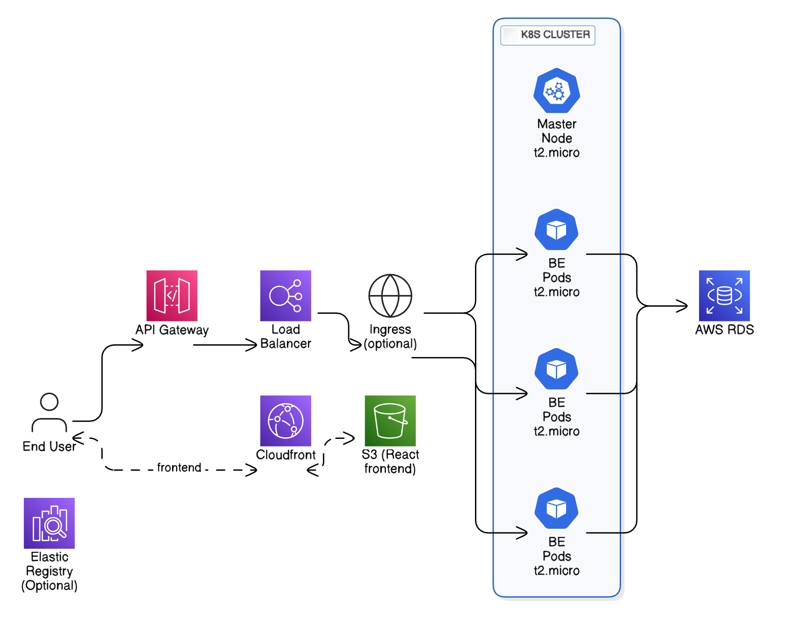

# QAirline Cloud Infrastructure

## Infrastructure Overview


End users initiate requests through **Amazon CloudFront**, which serves as a global content delivery network (CDN) providing low-latency access, HTTPS support, and custom domain integration.

Static assets for the **React frontend** are hosted on **Amazon S3**, and CloudFront caches and delivers this content efficiently to users.

Once the frontend is loaded, subsequent data requests from the client are routed through **Amazon API Gateway**, which acts as a secure and scalable entry point for backend services. API Gateway forwards these requests to an **Application Load Balancer (ALB)** integrated with an **Amazon EKS** (Elastic Kubernetes Service) cluster via Kubernetes Ingress.

Within the EKS cluster, backend services run in scalable Pods, processing requests and managing business logic. These services interact with a **relational database** hosted on **Amazon RDS** (Relational Database Service) for persistent data storage.

This architecture ensures scalability, security, and high availability across both frontend and backend components.



# How to run


## Infrastructure Provisioning
To provision the cloud infrastructure, first create a profile named devops-user, with enough permissions to create S3 buckets, EC2 instances, RDS, VPCs, CDNs.

Then run 

```  bash
terraform init
terraform plan 
terraform apply
```

## Creating The K8s Cluster


To populate hosts.ini with updated ip address, run the **generate_inventory** python file in **scripts** directory
Note you will have to have created a ssh key before hand at "~/.ssh/id_rsa.pub"
To create the k8s cluster, cd into the ansible dir, then run

``` bash
ansible-playbook -i inventory/hosts.ini -u ubuntu master_playbook.yml
```

## Deploying React Frontend

Run the **deploy_frontend_to_s3** python file in **scripts** directory
